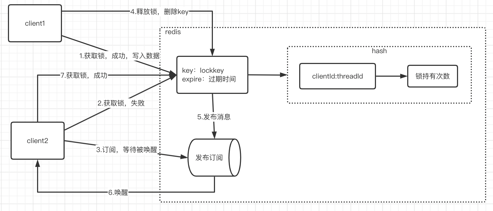
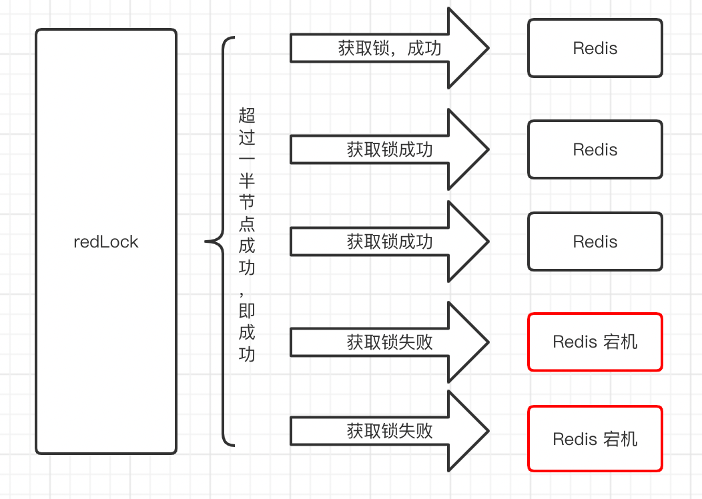
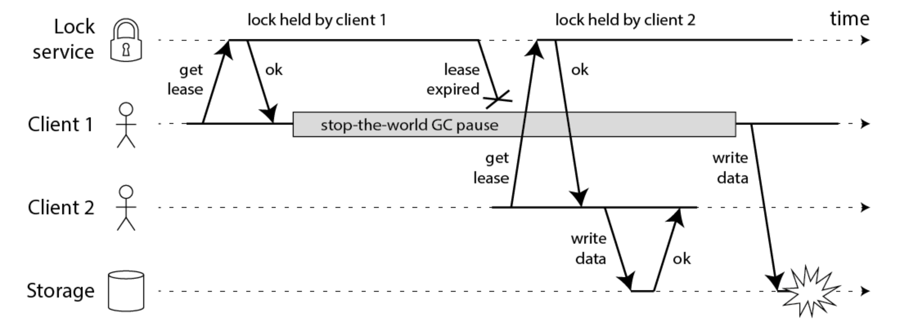
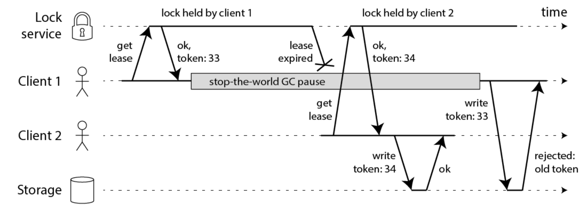
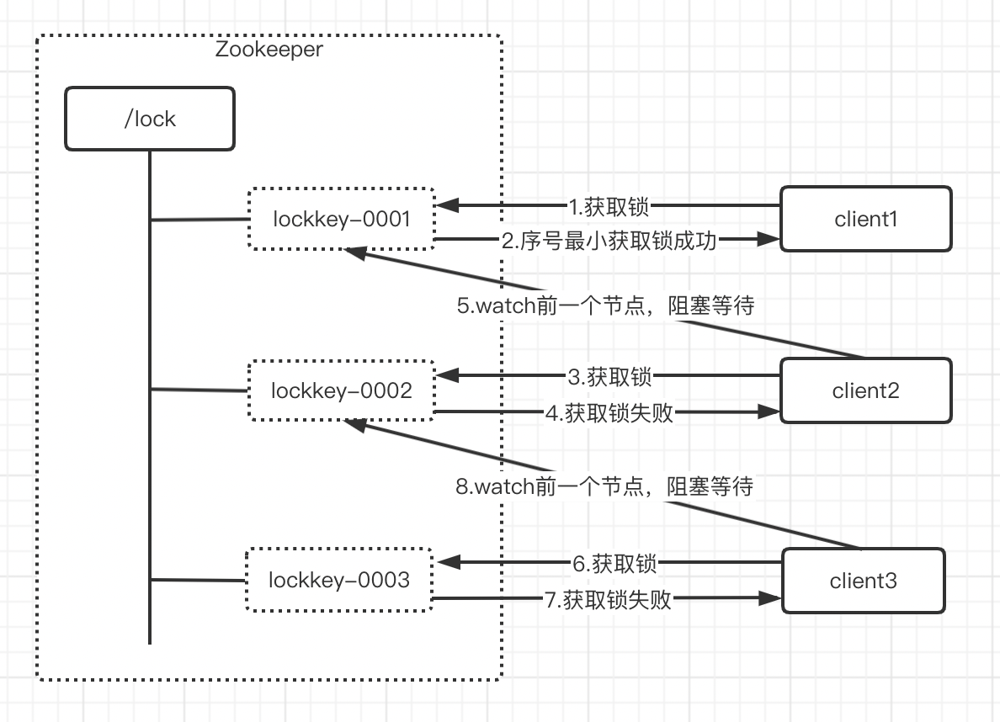
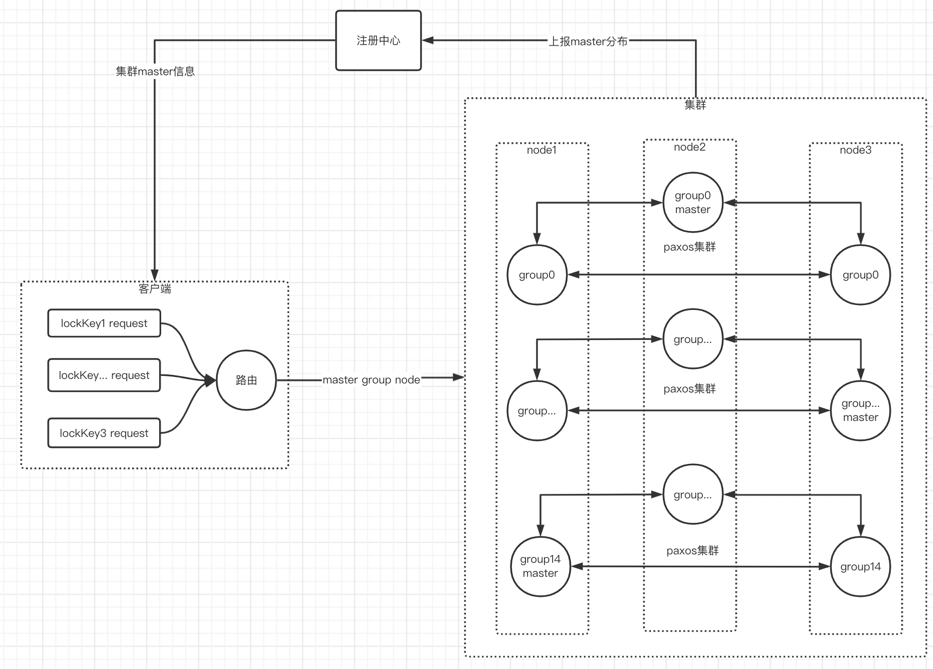
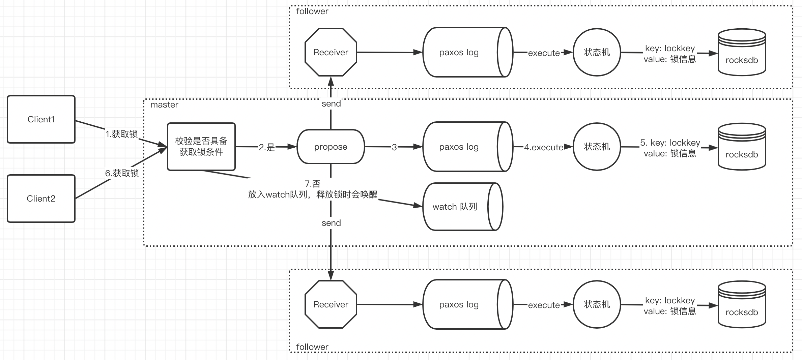

# 分布式锁实现对比
## 分布式锁概述
主要解决分布式环境下运行的多进程、多线程对共享资源的互斥访问控制，协调他们对共享资源的访问调度
## 分布式锁功能特性
- 互斥：任意时刻，只有一个线程能持有锁。
- 可重入：已经持有锁的线程，允许再次获取到锁
- 锁超时释放：持有锁超时，可以释放，防止死锁，和不必要的资源浪费
- 自动续约：防止业务逻辑未执行完，锁过期释放，自动延长锁过期时间。
- 阻塞与非阻塞：阻塞获取锁方式和非阻塞获取锁方式
- 安全性：无论发生什么情况，不能影响锁的一致性状态
- 高可用：锁的操作要高可用
- 高性能：锁的操作响应时间要短，服务端吞吐量要高
## 分布式锁使用场景
### 避免无效工作
用来避免重复执行同样工作，比如：某一时刻的定时任务，执行一次就好；实现接口的幂等；等操作。如果只是用于该目的，对性能要求很高
### 数据正确性
某些逻辑存在并发问题，并发执行会使数据错乱，可以用分布式锁来实现同步执行，保证数据的正确
## 常见分布式锁实现
### redis
#### 实现原理
- 代码使用示例

```java
//加锁逻辑
String lockKey = "lockKey";
String value = "uuid";
SetParams setParams = SetParams.setParams().nx().ex(5);
String result = jedis.set(lockKey, value, setParams);
if ("OK".equals(result)) {
  System.out.println("获取锁成功");
}

```
```java
// 释放锁逻辑
jedis.del("lockKey");

// 释放锁逻辑存在一定问题，直接将锁删除并没有校验，自己是否持有锁，正确做法是用lua脚本
List<String> keys = new ArrayList<String>();
keys.add("lockkey");
List<String> args = new ArrayList<String>();
args.add("uuid");
Long res = jedis.eval("if redis.call('get', KEYS[1])==ARGV[1] then return redis.call('del', KEYS[1]) else return 0 end", keys, args);
if(res == 1) {
 	// 释放锁成功 
}
```
- 互斥的实现：使用redis提供的setNX功能来实现互斥，setNX作用是如果key不存在设置key，如果存在设置失败，通过返回值进行区分。
- 锁超时释放实现：redis可以为key设置过期时间，过期后删除
- 安全性：redis并非强可靠性数据库，redis主从架构，主库宕机时，还未同步到从库的数据会存在丢失情况，安全性得不到保证
- 高可用：主从架构或集群架构，主库宕机，在从库切成主的这段时间不可用；
- 高性能：redis性能很高

#### 优点
- 性能高；
- 使用简单，代码复杂度低
#### 存在问题
- 功能不完善，如果自己实现存在较大复杂度;
- 安全性问题：redis并非强可靠性数据库，redis主从架构，主库宕机时，还未同步到从库的数据会存在丢失情况，安全性得不到保证;
- 高可用问题：主从架构或集群架构，主库宕机，在从库切成主的这段时间不可用；
#### 总结
- 实现简单，性能高，但功能支持太少，存在高可用，安全性问题，使用场景比较单一；
- 由于存在redis高可用，安全性问题，不适合用在数据正确性场景；
- redisson框架基于redis封装了分布式锁的一套完成操作，功能上得到了完善；
### redisson
#### 实现原理


基于redis的hash结构和发布订阅功能实现，key是lockkey，key上设置过期时间实现锁过期释放，hash内存储field是线程的唯一标识，value存储锁持有次数；发布订阅用于实现阻塞方式获取锁。
- 代码使用示例

```java
Config config = new Config();
        config.useSingleServer().setAddress("redis://127.0.0.1:6379");
RedissonClient redissonClient = Redisson.create(config);
RLock lock = redissonClient.getLock(lockKey);

// 获取锁
lock.lock();
//释放锁
lock.unlock();
```
- redis lua脚本介绍：lua是一个脚本语言，可以将一段lua脚本发送给redis执行，实现一些复杂的逻辑，并且脚本整体作为一个原子操作；redisson使用lua脚本实现了分布式锁的功能。
- 数据结构设计：
```json
{
    "lockkey":{
        "clientId:threadId":"持有锁次数"
    }
}
```
使用redis的hash结构，lockkey作为key，key上设置过期时间实现锁的过期；hash内field为 "clientId:threadId" 标识分布式环境线程的唯一标识，value代表了锁持有的次数。
- lua脚本分析，获取锁逻辑

```java
// KEYS[1] = lockkey;
// ARGV[1] = leaseTime
// ARGV[2] = client:threadId

if (redis.call('exists', KEYS[1]) == 0) then //判断lockkey是否不存在
  	// 锁没被占用
	redis.call('hincrby', KEYS[1], ARGV[2], 1); // 设置锁持有者 client:threadId，持有次数为1 
	redis.call('pexpire', KEYS[1], ARGV[1]); 	// 设置锁的过期时间
	return nil; 
end; 
// 走到这里说明锁已经有持有者了
if (redis.call('hexists', KEYS[1], ARGV[2]) == 1) then // 判断锁的持有者是否是自己
	// 锁持有者是自己，再次获取锁，属于锁的重入
    redis.call('hincrby', KEYS[1], ARGV[2], 1); // 重入，锁持有次数加一
	redis.call('pexpire', KEYS[1], ARGV[1]); 	// 重新设置锁过期时间
	return nil; 
end; 
// 走到这里说明锁已经被其它线程占有
return redis.call('pttl', KEYS[1]); // 返回锁剩余过期时间，用于阻塞等待
```
- lua脚本分析，释放锁逻辑

```java
// KEYS[1] = lockkey;
// KEYS[2] = redisson_lock__channel:{lockkey};
// ARGV[1] = 0
// ARGV[2] = leaseTime
// ARGV[3] = client:threadId

if (redis.call('hexists', KEYS[1], ARGV[3]) == 0) then // 验证释放锁的线程是否是锁的持有者
    return nil; // 不是锁的持有者结束
end; 
// 是锁的持有者
local counter = redis.call('hincrby', KEYS[1], ARGV[3], -1); // 锁持有次数-1
if (counter > 0) then // 锁重入情况，存在counter>0
  	// 锁重入场景，释放锁将锁持有次数-1，但锁并未释放
    redis.call('pexpire', KEYS[1], ARGV[2]); //修改锁过期时间
    return 0; 
else 
  	// 进入这里说明锁持有次数变为0，进行释放操作
    redis.call('del', KEYS[1]); // 将key删除，即是释放
    redis.call('publish', KEYS[2], ARGV[1]);  //广播通知，等待锁的客户端
    return 1; 
end; 
return nil;
```
通过上述逻辑，已经分析了，互斥，可重入，锁超时释放，锁释放，阻塞唤醒的实现；
- 锁自动续约分析

```java
private <T> RFuture<Long> tryAcquireAsync(long waitTime, long leaseTime, TimeUnit unit, long threadId) {
        RFuture<Long> ttlRemainingFuture;
        if (leaseTime > 0) {
            ttlRemainingFuture = tryLockInnerAsync(waitTime, leaseTime, unit, threadId, RedisCommands.EVAL_LONG);
        } else {
            ttlRemainingFuture = tryLockInnerAsync(waitTime, internalLockLeaseTime,
                    TimeUnit.MILLISECONDS, threadId, RedisCommands.EVAL_LONG);
        }
        CompletionStage<Long> f = ttlRemainingFuture.thenApply(ttlRemaining -> {
         
          	if (ttlRemaining == null) { // ttlRemaining == null，获取锁成功，ttlRemaining锁的过期时间，获取锁失败时才会有值
              	
                if (leaseTime > 0) { // 对于明确指定了锁的过期时间，不做自动续约
                    internalLockLeaseTime = unit.toMillis(leaseTime);
                } else {
                  	// 开启定时任务做自动续约
                    scheduleExpirationRenewal(threadId);
                }
            }
            return ttlRemaining;
        });
        return new CompletableFutureWrapper<>(f);
    }
```
```java
// 关键自动续约逻辑
Timeout task = commandExecutor.getConnectionManager().newTimeout(new TimerTask() {
    @Override
    public void run(Timeout timeout) throws Exception {
        ExpirationEntry ent = EXPIRATION_RENEWAL_MAP.get(getEntryName());
        if (ent == null) {
            return;
        }
        Long threadId = ent.getFirstThreadId();
        if (threadId == null) {
            return;
        }
        // 执行lua脚本修改锁过期时间，由于存在锁持有者一致性校验，所以使用lua脚本来做
        // 续约脚本 if (redis.call('hexists', KEYS[1], ARGV[2]) == 1) then redis.call('pexpire', KEYS[1], ARGV[1]); return 1; end; return 0;
        CompletionStage<Boolean> future = renewExpirationAsync(threadId);
        future.whenComplete((res, e) -> {
            if (e != null) {
                log.error("Can't update lock " + getRawName() + " expiration", e);
                EXPIRATION_RENEWAL_MAP.remove(getEntryName());
                return;
            }
            
            if (res) { // res为true锁持有者还是自己
                renewExpiration(); // 再次开启续约任务
            } else {
                cancelExpirationRenewal(null); // 持有者不是自己，取消续约任务
            }
        });
    }
}, internalLockLeaseTime / 3, TimeUnit.MILLISECONDS); // 续也任务的间隔，时锁过期时间的三分之一，默认的续约续约间隔时10s
```
#### 优点
- 性能高
- 功能支持的全

#### 存在问题
- 安全性问题：redis并非强可靠性数据库，redis主从架构，主库宕机时，还未同步到从库的数据会存在丢失情况，安全性得不到保证
- 高可用问题：主从架构或集群架构，主库宕机，在从库切成主的这段时间不可用；
#### 总结
- 功能支持全，性能高，适合避免无效工作的场景；
- 由于存在redis高可用，安全性问题，不适合用在数据正确性场景；
- 为来解决redis高可用问题，安全性问题，设计出了redlock
### redlock
#### 实现原理


- 说明redlock实现原理之前先分析下redis存在高可用，安全问题的本质原因，我总结为单点问题，主从架构主节点宕机，存在丢失数据，不能第一时间恢复；redlock解决这个问题的思想就是多节点，redlock串行将获取锁请求发送给多个节点，当有一半以上的节点返回成功，操作就成功了，如果超过一半失败时，获取锁成功的节点会做释放锁操作；如果是5个node，那么允许2个节点异常，高可用，数据丢失问题得到解决；但数据正确性问题并没有得到解决，后面我会具体分析；
- 代码使用示例

```java
// 创建多个redis客户端，访问不同的redis节点
 RedissonClient redissonClient; 
 RedissonClient redissonClient2;
 RedissonClient redissonClient3;
 Config config = new Config();
 config.useSingleServer().setAddress("redis://127.0.0.1:6379");
 redissonClient = Redisson.create(config);

 Config config2 = new Config();
 config2.useSingleServer().setAddress("redis://127.0.0.2:6379");
 redissonClient2 = Redisson.create(config2);

 Config config3 = new Config();
 config3.useSingleServer().setAddress("redis://127.0.0.3:6379");
 redissonClient3 = Redisson.create(config3);
 String lockKey = "lockkey";
 // 创建红锁，红锁本质是多个普通的锁的聚合
 RedissonRedLock redLock = new RedissonRedLock(redissonClient.getLock(lockKey), redissonClient2.getLock(lockKey), redissonClient3.getLock(lockKey));
 redLock.lock(); // 获取锁
 redLock.unlock(); // 释放锁
```
- 获取锁

```java
//RedissonRedLock 实现分析
// redlock 继承于 RedissonMultiLock（联锁），联锁内部聚合多个RLock
public class RedissonRedLock extends RedissonMultiLock {

	// 多个普通锁，聚合成红锁
    public RedissonRedLock(RLock... locks) {
        super(locks);
    }

  	// 允许失败的最大锁数量，locks.size()/2 + 1个锁成功，操作就成功
    @Override
    protected int failedLocksLimit() {
        return locks.size() - minLocksAmount(locks);
    }
    
    protected int minLocksAmount(final List<RLock> locks) {
        return locks.size()/2 + 1;
    }

    @Override
    protected long calcLockWaitTime(long remainTime) {
        return Math.max(remainTime / locks.size(), 1);
    }
    
    @Override
    public void unlock() {
        unlockInner(locks);
    }

}
```
```java
 // 获取锁逻辑
    public boolean tryLock(long waitTime, long leaseTime, TimeUnit unit) throws InterruptedException {
        long newLeaseTime = -1;
        if (leaseTime != -1) {
            if (waitTime == -1) {
                newLeaseTime = unit.toMillis(leaseTime);
            } else {
                newLeaseTime = unit.toMillis(waitTime)*2;
            }
        }
        
        long time = System.currentTimeMillis();
        long remainTime = -1;
        if (waitTime != -1) {
            remainTime = unit.toMillis(waitTime);
        }
        long lockWaitTime = calcLockWaitTime(remainTime);
        
        int failedLocksLimit = failedLocksLimit(); // 允许失败的个数，如果5个节点，该值为2
        List<RLock> acquiredLocks = new ArrayList<>(locks.size()); // 获取锁成功的节点
       // 遍历RLock，将获取锁的指令发送到所有节点
        for (ListIterator<RLock> iterator = locks.listIterator(); iterator.hasNext();) { 
            RLock lock = iterator.next();
            boolean lockAcquired;
            try {
                if (waitTime == -1 && leaseTime == -1) {
                    lockAcquired = lock.tryLock();
                } else {
                    long awaitTime = Math.min(lockWaitTime, remainTime);
                    lockAcquired = lock.tryLock(awaitTime, newLeaseTime, TimeUnit.MILLISECONDS);
                }
            } catch (RedisResponseTimeoutException e) {
                unlockInner(Arrays.asList(lock));
                lockAcquired = false;
            } catch (Exception e) {
                lockAcquired = false;
            }
            
            if (lockAcquired) {
                // 获取锁成功，加入到集合中
                acquiredLocks.add(lock);
            } else {
              	// 当前节点获取锁失败
            	// 节点总数量 - 成功的节点数量 == 允许失败的节点数量，逻辑为true，意味着成功的数据已经满足条件
                if (locks.size() - acquiredLocks.size() == failedLocksLimit()) {
                  // 超过一半的节点获取锁成功，整体获取锁成功，跳出循环  
                  break;
                }

                if (failedLocksLimit == 0) {
                  	// 失败的节点的数量已经达到限制，整体获取锁失败
                  	// 释放锁，将之前所有获取成功的锁，全部释放
                    unlockInner(acquiredLocks);
                    if (waitTime == -1) { 
                      	//非阻塞模式，waitTime=-1 直接结束
                        return false;
                    }
                  	
                    failedLocksLimit = failedLocksLimit();  // 重置失败限制数量
                    acquiredLocks.clear(); //清空获取锁成功节点集合
                    // RLock集合遍历重置，这三步重置操作，这是要重新再来一遍的意思，直到成功否则不会停止
                    while (iterator.hasPrevious()) {
                        iterator.previous();
                    }
                } else {
                  	failedLocksLimit--; // 允许失败次数减一
                }
            }
            
            if (remainTime != -1) {
              	// 针对有等待时间的获取锁操作，等待时间耗完，进行锁释放
                remainTime -= System.currentTimeMillis() - time;
                time = System.currentTimeMillis();
                if (remainTime <= 0) {
                    unlockInner(acquiredLocks);
                    return false;
                }
            }
        }

        if (leaseTime != -1) {
            acquiredLocks.stream()
                    .map(l -> (RedissonLock) l)
                    .map(l -> l.expireAsync(unit.toMillis(leaseTime), TimeUnit.MILLISECONDS))
                    .forEach(f -> f.toCompletableFuture().join());
        }
        
        return true;
    }
```
- 释放锁

```java
    // 释放锁逻辑
	public void unlock() {
        List<RFuture<Void>> futures = new ArrayList<>(locks.size());
        
      	// 释放锁逻辑十分简单，循环所有的RLock逐个执行释放
        for (RLock lock : locks) {
            futures.add(lock.unlockAsync());
        }

        for (RFuture<Void> future : futures) {
            future.toCompletableFuture().join();
        }
    }
```
#### 优点
- 性能高：虽然节点变多，串行获取锁，接口响应时间变长，但基于redis实现性能依然还是很高的
- 高可用：允许n - (n/2+1)节点失败
- 功能支持的全
- 安全性得到提升，允许n - (n/2+1)节点宕机数据丢失，但在某些场景依然存在安全问题，在存在问题里面会详细说明；
#### 存在问题
- 需要资源变多：官方建议使用5个节点，5个主节点，如果每个主节点挂一个从节点，需要10个节点
- 存在安全性性问题：<br>
  场景1：假设有5个节点A、B、C、D、E，客户端1获取锁操作A、B、C节点成功，D、E失败，超过半数成功，客户端1获取锁成功；这时候节点C宕机，重启节点，但数据由于没有来得及持久化会丢失；紧接着进客户端2发起获取锁操作，C、D、E都会加锁成功，客户端2也获取锁成功，两个客户端同时获取到锁；针对这种场景解决方案，可以延迟重启节点，可以等到锁过期释放后再重启，问题是这个时间具体是多久，不好评估；<br>
  场景2：时钟跳跃问题，假设有5个节点A、B、C、D、E，客户端1获取锁操作A、B、C节点成功，D、E失败，超过半数成功，客户端1获取锁成功；节点C发生时钟跳跃，导致提前过期释放；客户端2发起获取锁操作，C、D、E都会加锁成功; 存在数据;  <br>
  场景3：客户端长时间阻塞，导致服务端锁过期释放释放，被其它客户端拿到锁;<br>
  
    

  上面三种场景总结为同时两个客户端拿到锁；针对这种场景，大佬给出的解决方案，见下图；使用乐观锁的思想，引入token，token是一个全局递增的序列号，当获取锁成功后可以拿到token，在操作数据时和数据的token进行比较，token大的允许操作。redisson并没有提供这方面的功能，难点在于所有节点保证token的一致，顺序递增，这需要强一致性算法。详情参考：https://martin.kleppmann.com/2016/02/08/how-to-do-distributed-locking.html
  
  

#### 总结
- 在redisson单节点基础上，使用多节点来解决高可用和安全性问题（并未彻底解决）；
- redlock性能依然还是高的，如果需要高可用的，高并发的避免无效工作的场景，非常适合；
- 在数据正确性场景我不建议使用，在上述的问题场景已经分析过，但如果你认为那些问题场景出现概率极低，在控制得当情况下，可以避免，或就算出现了数据正确性问题，你依然有别的方式修复，那redlock还是很适合的。
- 要想解决数据正确性问题，需要使用强一致性算法paxos类型架构实现的分布式锁，比如zookeeper

### zookeeper
#### 实现原理
zookeeper是基于强一致算法zab协议实现了一套类似文件系统的功能；zookeeper的节点类型有一种临时顺序节点，临时是指当客户端与服务端连接断开，创建的节点会自动删除，顺序是指当创建同一个名称的节点时，节点名加上一个序号作为节点名称，序号按照节点创建顺序递增；zookeeper的watch功能用来监听节点的变化的，当节点发生变化时，会通知客户端；获取锁操作会在zookeeper创建临时顺序节点，序号最小的获取到锁，为获取到锁的client的进入阻塞等待并监听自己节点的前一个节点，节点释放时会通知client获取锁。
- 获取锁分析
  
  

  client发送获取锁请求，在zookeeper上创建一个临时顺序节点，然后获取目录下所有的节点列表，比较自己的节点的序号是否是最小的，如果是获取锁成功，否获取锁失败，获取锁失败后watch自己节点的前一个节点，当持有锁的节点释放后，会通知下一个节点的client；下面分析一段curator框架的实现

```java
// millisToWait：最大的等待时间；ourPath：自己节点的path，创建逻辑就不展示了
private boolean internalLockLoop(long startMillis, Long millisToWait, String ourPath) throws Exception
    {
        boolean     haveTheLock = false; //标识当前节点是否持有锁
        boolean     doDelete = false;	// 到达最大等待时间
        try
        {
            if ( revocable.get() != null )
            {
                client.getData().usingWatcher(revocableWatcher).forPath(ourPath);
            }
			
            // client端状态是STARTED，并且没有获取到锁，进入while
            while ( (client.getState() == CuratorFrameworkState.STARTED) && !haveTheLock )
            {
                List<String>        children = getSortedChildren(); // 查询锁目录下所有节点并排序
                String              sequenceNodeName = ourPath.substring(basePath.length() + 1); // 获取当前节点的序号

                PredicateResults    predicateResults = driver.getsTheLock(client, children, sequenceNodeName, maxLeases); // 获取锁，判断是否符合获取锁的条件，后面分析
                if ( predicateResults.getsTheLock() )
                {
                	// 获取锁成功
                    haveTheLock = true;
                }
                else
                {
                	// 获取锁失败
                    // 得到当前节点的前一个节点，要watch前一个节点
                    String  previousSequencePath = basePath + "/" + predicateResults.getPathToWatch();

                    synchronized(this)
                    {
                        try 
                        {
                            // watch 前一个节点，后面分析watcher逻辑，会唤醒wait
                            client.getData().usingWatcher(watcher).forPath(previousSequencePath); 
                            if ( millisToWait != null ) // 存在等待时间
                            {
                                millisToWait -= (System.currentTimeMillis() - startMillis);
                                startMillis = System.currentTimeMillis();
                                if ( millisToWait <= 0 )
                                {
                                	// 等待时间耗尽，记录删除标记，后面删除临时节点
                                    doDelete = true; 
                                    break;
                                }

                                wait(millisToWait); // 阻塞等待有等待时间
                            }
                            else
                            {
                                wait(); // 阻塞等待
                            }
                        }
                        catch ( KeeperException.NoNodeException e ) 
                        {
                            // it has been deleted (i.e. lock released). Try to acquire again
                        }
                    }
                }
            }
        }
        catch ( Exception e )
        {
            ThreadUtils.checkInterrupted(e);
            doDelete = true;
            throw e;
        }
        finally
        {
            if ( doDelete )
            {
            	// 过期扔没有获取到锁，删除
                deleteOurPath(ourPath);
            }
        }
        return haveTheLock; // 返回获取锁的状态
    }
```
```java
    // children：锁目录下所有的节点序号排序结果；sequenceNodeName：自己节点的序号；maxLeases：值为1
	public PredicateResults getsTheLock(CuratorFramework client, List<String> children, String sequenceNodeName, int maxLeases) throws Exception
    {
        int             ourIndex = children.indexOf(sequenceNodeName); // 获取自己的节点在列表中的位置
        validateOurIndex(sequenceNodeName, ourIndex);

        boolean         getsTheLock = ourIndex < maxLeases; // 节点列表排序后序号最小的一定是位置为0的，自己节点位置为0获取锁成功
        String          pathToWatch = getsTheLock ? null : children.get(ourIndex - maxLeases); // 获取锁失败找到前一节点

        return new PredicateResults(pathToWatch, getsTheLock);
    }

```
```java
	// 当监听的节点删除时会触发watch	
	private final Watcher watcher = new Watcher()
    {
        @Override
        public void process(WatchedEvent event)
        {
            notifyFromWatcher();
        }
    };

	private synchronized void notifyFromWatcher()
    {
        notifyAll(); // 唤醒wait等待的线程
    }
```
- 释放锁分析<br>
  释放锁逻辑非常简单，只需将节点删除，下面看下curator框架的实现

```java
    private void deleteOurPath(String ourPath) throws Exception
    {
        try
        {
            client.delete().guaranteed().forPath(ourPath); // 删除节点
        }
        catch ( KeeperException.NoNodeException e )
        {
          
        }
    }
```
- 锁重入分析<br>
  锁重入的实现是在客户端做的，使用一个map key是线程对象，值是锁持有次数，重入时持有次数加一，下面看下curator框架的实现

```java
	// 锁数据
	private static class LockData
    {
        final Thread owningThread; // 线程
        final String lockPath;	// 节点路径
        final AtomicInteger lockCount = new AtomicInteger(1); // 锁持有次数

        private LockData(Thread owningThread, String lockPath)
        {
            this.owningThread = owningThread;
            this.lockPath = lockPath;
        }
    }	

	// 获取锁
	private boolean internalLock(long time, TimeUnit unit) throws Exception
    {
        Thread currentThread = Thread.currentThread(); // 当前线程
		// threadData是ConcurrentMap，获取当前线程 LockData
        LockData lockData = threadData.get(currentThread); 
        if ( lockData != null ) 
        {
        	// 已经持有锁，锁测重入
            // 锁持有次数加一
            lockData.lockCount.incrementAndGet();
            return true;
        }

		// 没有持有锁
		// 获取锁，核心逻辑上面分析过
        String lockPath = internals.attemptLock(time, unit, getLockNodeBytes()); 
        if ( lockPath != null )
        {
        	// 获取锁成功设置 LockData
            LockData newLockData = new LockData(currentThread, lockPath);
            threadData.put(currentThread, newLockData);
            return true;
        }
 		// 获取锁失败
        return false;
    }
```

- 锁过期释放，锁自动续约实现
  利用zookeeper自带的功能，客户端与服务端会维护一个session，客户端会定时发送心跳，续约session过期时间，如果服务端检测到session过期，临时顺序节点便会删除即释放锁
- 高可用
  zookeeper集群的高可用允许 n - (n/2+1)个节点宕机，但如果leader节点宕机，集群在选举出leader之前是不可用的
- 安全性
  zookeeper使用强一致算法zab，节点间的数据都是一致的；
  在redlock章节最后讨论中，redlock在两个客户端同时获取到锁的场景存在数据安全问题，那么在zookeeper中能否解决呢，如果只是使用我上面介绍的方式，答案是不行，要想彻底解决，LockData里需要加一个zxid，每创建一个临时节点都会生成一个zxid，使用zxid实现乐观锁，可以解决这个问题的。

#### 优点
安全性，数据正确性高
#### 存在问题
- 性能太差，zookeeper不适合写多的场景
- 功能提供不完善，需要自己实现
- 高可用一般，虽然允许 n - (n/2+1)个节点宕机，但如果leader节点宕机，恢复期间是不可用的
#### 总结
在低并发，数据正确性要求高的场景，可以使用；在并发高，高可用场景不适合
### wlock
#### 实现原理
wlock基于wpaxos实现了一套分布式锁，wpaxos是强一致算法Multi-Paxos的一套实现，也是58开源项目；是专门针对分布式锁设计的，具有高性能，高可用，高可靠特性；client获取锁时校验锁是否空闲，空闲时写入锁数据，其它client放入watch队列，等待锁释放唤醒，唤醒后获取到锁再通知client端。
- 整体架构

   

  可以看到三个角色，客户端，服务端集群，注册中心；先从最核心的服务端集群介绍，集群由多个node组成，node内由15个独立的group组成，相同编号的group node构成了一个paxos集群，服务端集群也可以说由15个paxos集群组成；paxos集群要选出master节点，15个paxos集群就有15个master，master会均匀分布到node上；master分布信息会上报到注册中心；注册中心将master分布信息发送给客户端，客户端拿到master节点建立连接，发送获取锁请求，请求会根据lockkey做一个路由，来确定要发送的master node；
- 高性能设计
  
  

  client端根据lockkey路由到不同的master group node上，group内部由多线程进行处理，锁请求根据lockkey路由到不同线程，多线程并发生成propose request放入队列，将队列里的propose合并成batch propose发送给从节点，锁的数据最终存入高性能key value型本地数据库RocksDB。
  高性能设计总结
  并行处理：多分组，多线程架构；每个分组组成了一个独立运行的paxos集群，存在自己的master，能独立提供服务；每个分组内有多个处理线程，可以并行处理请求，最大程度上利用资源；
  充分利用所有node资源：多分组架构，每个分组组成了一个独立运行的paxos集群，存在自己的master，多个master均匀分布到所有的node上，请求由master进行处理，所有的node都参与了请求的处理，node资源都得到了利用；
  负载均衡：使用lockkey路由策略，锁请求被路由到不同的master 分组节点上，实现流量的均衡
  提高网络传输效率：propose请求合并为Batch propose，批量量发送；实现合并批量发送并不难，难在合并多线程，平行执行下，如果保证同一lockkey请求的按顺序合并，执行；方案：保证同一个lockkey请求路由到同一个线程队列中，利用单线程的顺序执行，来保证顺序；
  合适的锁数据存储：使用高性能key value本地数据库rocksdb，lockkey作为key，锁信息作为value，简单高效。
- 获取锁分析
  
    

  上图是获取锁流程，将分别介绍关键点，来分析wlock的实现
  rocksdb：高效的key value数据库，负责存储锁信息，当client端获取到锁会存入锁信息，锁信息数据格式如下

```java
// 锁信息
public class ReentrantLockValue {
	//客户端协议版本
	private byte version;
	//最新锁版本号，本质是paxos增值的instanId，类比zookeeper的zxid
	private long lockVersion;
	//锁状态 目前没用到
	private int status;
	//锁类型 目前支持分布式锁和读写锁两种
	private int lockType;

	/**
	 * 锁持有者
	 * 读写锁情况下为写锁的持有者
	 */
	private LockOwnerInfo lockOwnerInfo;

	//读锁数量
	private int readOwnerCount;
	//读锁持有者 key: ip+pid+threadId
	private Map<String, LockOwnerInfo> rLockOwnerInfos = new HashMap<String, LockOwnerInfo>();
}

// 锁持有者信息
public class LockOwnerInfo {
	private int ip;
	private long threadId;
	private int pid;
	//锁过期时间
	private long expireTime;

	//锁版本号
	private long lockVersion;
}
```
状态机：master发起的propose最终会形成顺序的paxos log，线性执行状态机，主从节点执行顺序一致，锁状态机逻辑如下

```java
// LockStateMachine
// groupIdx: 分组； instanceID: paxos递增的ID每发起一个propose就会+1
// paxosValue: 锁的请求信息； smCtx: 上下文信息状态机执行结果可以放入，发起propose位置可以拿到
public boolean execute(int groupIdx, long instanceID, byte[] paxosValue, SMCtx smCtx) {
		if(!MigrateService.getInstance().isSyncToMigratePoint(groupIdx)) {
			LOGGER.error("LockStateMachine not Sync To Migrate Point. groupId: {} instanceId: {}", groupIdx, instanceID);
			return false;
		}

		long start = System.currentTimeMillis();
		byte protocolType = paxosValue[BaseLockDO.PROYOCOL_TYPE_OFFSET];
		LockSmCtx lockSmCtx = null;
		if (smCtx != null && smCtx.getpCtx() != null) {
			lockSmCtx = (LockSmCtx) smCtx.getpCtx();
		}
		if (lockSmCtx != null) {
			lockSmCtx.setLockRet(LockResult.SUCCESS);
		}
		boolean result = false;
		if (ProtocolType.ACQUIRE_LOCK == protocolType) { // 获取锁操作
			AcquireLockDO acquireLockDO;
			acquireLockDO = AcquireLockDO.fromBytes(paxosValue);
          	// 分组的版本，做分组迁移的时候会+1，默认是0
			long groupVersion = GroupMetaService.getInstance().getGroupVersion(groupIdx);
			// 计算锁的版本号
          	long lockVersion = (groupVersion << 48) + instanceID;
			// 执行获取锁逻辑，下面分析
			result = reentrantLock(acquireLockDO.getLockType()).tryAcquireLock(acquireLockDO, lockVersion, groupIdx, lockSmCtx);
		} else if (ProtocolType.RENEW_LOCK == protocolType) { // 续约锁操作
			RenewLockDO renewLockDO;
			renewLockDO = RenewLockDO.fromBytes(paxosValue);
			result = reentrantLock(renewLockDO.getLockType()).renewLock(renewLockDO, groupIdx, lockSmCtx);
		} else if (ProtocolType.RELEASE_LOCK == protocolType) { // 释放锁操作
			ReleaseLockDO releaseLockDO;
			releaseLockDO = ReleaseLockDO.fromBytes(paxosValue);
			result = reentrantLock(releaseLockDO.getLockType()).releaseLock(releaseLockDO, groupIdx, lockSmCtx);
		} else if (ProtocolType.DELETE_LOCK == protocolType) { // 删除锁操作
			DeleteLockDO deleteLockDO;
			deleteLockDO = DeleteLockDO.fromBytes(paxosValue);
			result = reentrantLock(deleteLockDO.getLockType()).deleteLock(deleteLockDO, groupIdx, lockSmCtx);
		} else if (lockSmCtx != null) {
			LOGGER.error("unknow protocol {}", protocolType);
			lockSmCtx.setLockRet(LockResult.PROTOCOL_TYPE_ERROR);
		}
		checkpointManager.executeForCheckpoint(groupIdx, super.getSMID(), instanceID, paxosValue); // 保存到checkpoint 某instanceId开始的一个快照
		long cost = System.currentTimeMillis()-start;
		if(cost>200){
			LOGGER.error("lock sm groupid {} execute cost {}",groupIdx,cost);
		}
		return result;
	}
```
```java
	// ReentrantLock
    // 获取锁逻辑，整个过程逻辑很简单，很多校验都前置了，状态机执行的阶段是propose后，比较消耗资源，所以只有真正具备操作条件的请求才会发送propose
	public boolean tryAcquireLock(AcquireLockDO acquireLockDO, long instanceID, int groupIdx, LockSmCtx smCtx) {
		String key = acquireLockDO.getLockKey();
        // 创建锁信息
		ReentrantLockValue lockvalue = createLockvalue(acquireLockDO, instanceID);
		try {
			Optional<ReentrantLockValue> lock = lockRepositroy.getLock(key, groupIdx);
			if (lock.isPresent() && lock.get().getLockVersion() > acquireLockDO.getFencingToken()) {
				// 锁存在校验锁的版本号
                if (smCtx != null) {
					smCtx.setLockRet(LockResult.TOKEN_ERROR);
				}
				return true;
			}
            // 锁信息存入了rocksdb
			lockRepositroy.lock(key, lockvalue, groupIdx);
			if (smCtx != null) {
				smCtx.setFencingToken(instanceID);
				smCtx.setExpireTime(acquireLockDO.getExpireTime());
			}
			return true;
		} catch (LockException e) {
			LOGGER.error("groupid {} {} try lock key : {} error.", groupIdx, acquireLockDO.getHost(), key);
			LOGGER.error(e.getMessage(), e);
			if (smCtx != null) {
				smCtx.setLockRet(LockResult.EXCEPTION);
			}
			return false;
		}
	}
```
校验是否具备获取锁条件：锁没被占用，锁过期了， 锁重入，优先级最高，下面结合代码分析

```java
	// ReentrantLockService
	// 	获取锁逻辑
	public boolean tryAcquireLock(LockContext lockContext, int groupId) {
		AcquireLockRequest acquireLockRequest = new AcquireLockRequest();
		try {
			acquireLockRequest.fromBytes(lockContext.getBuf());
		} catch (ProtocolException e) {
			LOGGER.error("try acquire lock error", e);
			ackAcquireLock(lockContext.getChannel(), acquireLockRequest, null, ResponseStatus.ERROR);
			return false;
		}

		long version = 0L;
		String key = acquireLockRequest.getLockKey();
		Optional<ReentrantLockValue> lock = null;
		try {
			lock = lockRepository.getLock(key, groupId); // 从rocksdb中获取锁信息
		} catch (LockException e) {
			LOGGER.error("{} acquire lock key : {} error.", acquireLockRequest.getHost(), key, e);
			ackAcquireLock(lockContext.getChannel(), acquireLockRequest, null, ResponseStatus.ERROR);
			return false;
		}

		ReentrantLockValue reentrantLockValue;
		if (lock.isPresent()) { //判断锁是否被占用
			reentrantLockValue = lock.get();
			LockOwnerInfo lockOwnerInfo = reentrantLockValue.getLockOwnerInfo(); // 持有者信息
			version = reentrantLockValue.getLockVersion(); // 锁的版本号
			if (!lockOwnerInfo.isExpire()) {  // 判断锁是否过期
              	// 判断是非是锁重入情况
				if (lock.get().getLockOwnerInfo().equals(acquireLockRequest.getHost(), acquireLockRequest.getThreadID(), acquireLockRequest.getPid())) {
	              	
                  	AcquireLockDO acquireLockDO = AcquireLockDO.fromRequest(acquireLockRequest, version);
					SMCtx ctx = createCtx();
					byte[] proposeMsg;
					try {
						proposeMsg = acquireLockDO.toBytes();
					} catch (ProtocolException e) {
						LOGGER.error("try acquire lock error", e);
						ackAcquireLock(lockContext.getChannel(), acquireLockRequest, null, ResponseStatus.ERROR);
						return false;
					}
                  
                  	// 重入场景允许获取锁，发送propose到从节点，会执行获取的状态机，是线性执行的，所有节点都会执行，上面分析了锁状态机逻辑
					ProposeResult propose = paxosService.batchPropose(proposeMsg, groupId, ctx, acquireLockRequest.getRegistryKey());
					LockSmCtx lockSmCtx = (LockSmCtx) ctx.getpCtx();
					if (propose.getResult() == PaxosTryCommitRet.PaxosTryCommitRet_OK.getRet() && lockSmCtx.getLockRet() == LockResult.SUCCESS) {
						LOGGER.debug("ip :{} pid {} threadid {} acquire lock key {} version {} groupid {}, acquire lock success ", acquireLockDO.getHost(), acquireLockDO.getPid(), acquireLockDO.getThreadID(), key, lockSmCtx.getFencingToken(), groupId);
						LockOwner lockOwner = new LockOwner(acquireLockRequest.getHost(), acquireLockRequest.getThreadID(), acquireLockRequest.getPid(), lockSmCtx.getFencingToken());
						LockClient lockClient = ClientManager.getInstance().createLockClient(key, groupId, lockContext.getChannel(), acquireLockRequest);
						ClientManager.getInstance().addLockClient(key, lockClient, groupId, lockContext.getChannel());
					  	// 回复客户端获取锁成功了		
                      	ackAcquireLock(lockContext.getChannel(), acquireLockRequest, lockOwner, ResponseStatus.SUCCESS);
						// 加入一个锁过期检测事件，会检测锁过期，触发释放	
                      	expireStrategyFactory.addExpireEvent(new LockExpireEvent(lockSmCtx.getExpireTime(), acquireLockDO.getLockKey(),
								groupId, lockSmCtx.getFencingToken(), acquireLockDO.getLockType(), acquireLockDO.getOpcode(), acquireLockDO.getHost(), acquireLockDO.getThreadID(), acquireLockDO.getPid()));
						traceWorker.offer(new LockTrace(TimeUtil.getCurrentTimestamp(), ProtocolType.ACQUIRE_LOCK, IPUtil.getIpStr(acquireLockDO.getHost()), acquireLockDO.getThreadID(),
								acquireLockRequest.getPid(), acquireLockRequest.getLockKey(), lockSmCtx.getFencingToken(), acquireLockRequest.getRegistryKey(), lockSmCtx.getExpireTime(), LockCodeEnum.Reentrant_Lock));

						return true;
					}

					ackAcquireLock(lockContext.getChannel(), acquireLockRequest, null, ResponseStatus.ERROR);
					return false;
				}

				if (acquireLockRequest.isBlocked()) {
					LOGGER.debug("ip :{} pid {} threadid {} acquire lock key {}  groupid {}, lock exist wait.", acquireLockRequest.getHost(), acquireLockRequest.getPid(), acquireLockRequest.getThreadID(), key, groupId);
					LockClient lockClient = ClientManager.getInstance().createLockClient(key, groupId, lockContext.getChannel(), acquireLockRequest);
					WatchEvent watchEvent = watchService.genWatchEvent(acquireLockRequest, lockClient, reentrantLockValue.getLockVersion());
					// 阻塞模式获取锁，放入watch队列，等待锁释放唤醒
                  	watchService.addWatchEvent(key, watchEvent, groupId);
					ClientManager.getInstance().addLockClient(key,lockClient,groupId,lockContext.getChannel());
					ackAcquireLock(lockContext.getChannel(), acquireLockRequest, null, ResponseStatus.LOCK_WAIT);
				} else {
					LOGGER.debug("ip :{} pid {} threadid {} acquire get lock key {} groupid {}, lock exist return occupied.", acquireLockRequest.getHost(), acquireLockRequest.getPid(), acquireLockRequest.getThreadID(), key, groupId);
					ackAcquireLock(lockContext.getChannel(), acquireLockRequest, null, ResponseStatus.LOCK_OCCUPIED);
				}
				return false;
			}
			LOGGER.debug("ip :{} pid {} threadid {} acquire lock key {} version {} groupid {}, lock is expire ,propose delete key.", acquireLockRequest.getHost(), acquireLockRequest.getPid(), acquireLockRequest.getThreadID(), key, reentrantLockValue.getLockVersion(), groupId);
			proposeDeleteKey(acquireLockRequest, groupId, lockOwnerInfo);

			lockNotify.lockNotifyExpired(key, new LockOwner(lockOwnerInfo.getIp(), lockOwnerInfo.getThreadId(), lockOwnerInfo.getPid()), groupId);
		}
		
      	// 走到这里，两种情况锁没被占用或者锁过期了
		// 权重比较,选择优先级高的client允许获取锁
		AcquireLockDO acquireLockDO = null;
		boolean isFirstWatch;
		WatchEvent watchEvent = watchService.fetchFirstAcquiredWatchEvent(key, groupId);
		if (watchEvent != null && watchEvent.getWeight() >= acquireLockRequest.getWeight()) {
			acquireLockDO = AcquireLockDO.fromWatchEvent(key, watchEvent, version);
			isFirstWatch = true;
			LOGGER.info("acquire lock by watch events : {}.", watchEvent.getLockClient());
		} else {
			acquireLockDO = AcquireLockDO.fromRequest(acquireLockRequest, version);
			isFirstWatch = false;
		}
		SMCtx ctx = createCtx();
		byte[] proposeMsg;
		try {
			proposeMsg = acquireLockDO.toBytes();
		} catch (ProtocolException e) {
			LOGGER.error("try acquire lock error", e);
			ackAcquireLock(lockContext.getChannel(), acquireLockRequest, null, ResponseStatus.ERROR);
			return false;
		}

		ProposeResult propose = paxosService.batchPropose(proposeMsg, groupId, ctx, acquireLockRequest.getRegistryKey());
		LockSmCtx lockSmCtx = (LockSmCtx) ctx.getpCtx();
		if (propose.getResult() == PaxosTryCommitRet.PaxosTryCommitRet_OK.getRet() && lockSmCtx.getLockRet() == LockResult.SUCCESS) {
			if (isFirstWatch) {
				LockClient lockClient = watchEvent.getLockClient();
				LockOwner lockOwner = new LockOwner(lockClient.getcHost(), lockClient.getcThreadID(), lockClient.getcPid(), lockSmCtx.getFencingToken());
				lockNotify.lockNotifyUpdate(key, lockOwner, groupId);
				watchService.removeWatchEvent(key,groupId,watchEvent);
				if (acquireLockRequest.isBlocked()) {
					LockClient newLockClient = ClientManager.getInstance().createLockClient(key, groupId, lockContext.getChannel(), acquireLockRequest);
					WatchEvent newWatchEvent = watchService.genWatchEvent(acquireLockRequest, newLockClient, lockSmCtx.getFencingToken());
					// 阻塞模式获取锁，放入watch队列，等待锁释放唤醒	
                  	watchService.addWatchEvent(key, newWatchEvent, groupId);
					ClientManager.getInstance().addLockClient(key, newLockClient, groupId, lockContext.getChannel());
					LOGGER.debug("ip :{} pid {} threadid {} acquire lock key {} groupid {}, lock wait", acquireLockRequest.getHost(), acquireLockRequest.getPid(), acquireLockRequest.getThreadID(), key, groupId);
					ackAcquireLock(lockContext.getChannel(), acquireLockRequest, null, ResponseStatus.LOCK_WAIT);
				} else {
					LOGGER.debug("ip :{} pid {} threadid {} acquire lock key {} groupid {}, lock occupied", acquireLockRequest.getHost(), acquireLockRequest.getPid(), acquireLockRequest.getThreadID(), key, groupId);
					ackAcquireLock(lockContext.getChannel(), acquireLockRequest, null, ResponseStatus.LOCK_OCCUPIED);
				}
				traceWorker.offer(new LockTrace(TimeUtil.getCurrentTimestamp(), ProtocolType.ACQUIRE_LOCK, IPUtil.getIpStr(lockClient.getcHost()), lockClient.getcThreadID(),
						lockClient.getcPid(), acquireLockRequest.getLockKey(), lockSmCtx.getFencingToken(), acquireLockRequest.getRegistryKey(), lockSmCtx.getExpireTime(), LockCodeEnum.Reentrant_Lock));
			} else {
				LOGGER.debug("ip :{} pid {} threadid {} acquire lock key {} version {} groupid {}, acquire lock success ", acquireLockDO.getHost(), acquireLockDO.getPid(), acquireLockDO.getThreadID(), key, lockSmCtx.getFencingToken(), groupId);
				LockOwner lockOwner = new LockOwner(acquireLockRequest.getHost(), acquireLockRequest.getThreadID(), acquireLockRequest.getPid(), lockSmCtx.getFencingToken());
				lockNotify.lockNotifyUpdate(key, lockOwner, groupId);
				LockClient lockClient = ClientManager.getInstance().createLockClient(key, groupId, lockContext.getChannel(), acquireLockRequest);
				ClientManager.getInstance().addLockClient(key, lockClient, groupId, lockContext.getChannel());
				ackAcquireLock(lockContext.getChannel(), acquireLockRequest, lockOwner, ResponseStatus.SUCCESS);
				traceWorker.offer(new LockTrace(TimeUtil.getCurrentTimestamp(), ProtocolType.ACQUIRE_LOCK, IPUtil.getIpStr(acquireLockDO.getHost()), acquireLockDO.getThreadID(),
						acquireLockRequest.getPid(), acquireLockRequest.getLockKey(), lockSmCtx.getFencingToken(), acquireLockRequest.getRegistryKey(), lockSmCtx.getExpireTime(), LockCodeEnum.Reentrant_Lock));
			}
          	// 加入一个锁过期检测事件，会检测锁过期，触发释放	
			expireStrategyFactory.addExpireEvent(new LockExpireEvent(lockSmCtx.getExpireTime(), acquireLockDO.getLockKey(),
					groupId, lockSmCtx.getFencingToken(), acquireLockDO.getLockType(), acquireLockDO.getOpcode(), acquireLockDO.getHost(), acquireLockDO.getThreadID(), acquireLockDO.getPid()));
			return true;
		}

		LOGGER.error("ip :{} pid {} threadid {} acquire lock key {} groupid {}, acquire lock failed ", acquireLockRequest.getHost(), acquireLockRequest.getPid(), acquireLockRequest.getThreadID(), key, groupId);
		ackAcquireLock(lockContext.getChannel(), acquireLockRequest, null, ResponseStatus.ERROR);
		return false;
	}
```
客户端获取锁逻辑

```java
		
	// LockService
	// lockOption：锁的操作，下面有说明
	public AcquireLockResult tryAcquireLock(String lockkey, InternalLockOption lockOption) throws ParameterIllegalException {
		AcquireLockResult result = new AcquireLockResult();
		result.setRet(false);
		long startTimestamp = System.currentTimeMillis();
		lockParameterCheck(lockOption);
      	// 获取锁后本地会记录锁信息，锁重入情况会返回true
		if (this.lockManager.acquiredLockLocal(lockkey, lockOption)) {
			/*本地获取成功锁*/
			LockContext lockContext = lockManager.getLocalLockContext(lockkey, lockOption.getThreadID(), lockOption.getLockType(), lockOption.getLockOpcode());
			// 续约锁，重新修改下服务端锁过期时间
          	LockResult lockResult = renewLock(lockkey, lockContext.getLockVersion(), lockOption.getExpireTime(), lockOption.getThreadID(), lockOption.getLockType(), lockOption.getLockOpcode());
			if (!lockResult.isSuccess()) {
				this.lockManager.releaseLockLocal(lockkey, lockOption.getThreadID(), false, lockOption.getLockType(), lockOption.getLockOpcode());
			}

			result.setOwner(new LockOwner(InetAddressUtil.getIpInt(),lockOption.getThreadID(),lockOption.getPID()));
			result.setResponseStatus(lockResult.getResponseStatus());
			result.setRet(lockResult.isSuccess());
			result.setLockVersion(lockContext.getLockVersion());
			return result;
		}

		int timeout = (int) Math.min(this.wlockClient.getDefaultTimeoutForReq(), lockOption.getMaxWaitTime());
		WatchEvent watchEvent = null;
      
      	// 判断是非是阻塞方式获取锁
		if (lockOption.isWaitAcquire()) {
		
			watchEvent = new WatchEvent(lockkey, lockOption.getThreadID(),
					lockOption.getWatchID(), WatchType.ACQUIRE, startTimestamp);
			watchEvent.setLockOption(lockOption);
			watchEvent.setTimeout(lockOption.getMaxWaitTime());
          	// 在本地注册个WatchEvent
			this.watchManager.registerWatchEvent(lockkey, watchEvent);
		}

      	// 根据lockkey计算路由到的group
		int groupId = this.wlockClient.getRegistryKey().getGroupId(lockkey);
		AcquireLockRequest acquireLockReq = protocolFactory.createAcquireReq(lockkey, groupId, lockOption);
		try {
          	// 发送获取锁请求到服务端
			SendReqResult sendReqResult = this.serverPoolHandler.syncSendRequest(acquireLockReq, timeout, "tryAcquireLock " + lockkey);
			if (sendReqResult != null) {
				AcquireLockResponse resp = new AcquireLockResponse();
				resp.fromBytes(sendReqResult.getData());
				result.setResponseStatus(resp.getStatus());
				if (resp.getStatus() == ResponseStatus.LOCK_WAIT) {
					logger.debug(Version.INFO + ", tryAcquireLock status : " + ResponseStatus.toStr(resp.getStatus()) + ", lockkey : " + lockkey + ", threadID : " + lockOption.getThreadID());
                  	// 服务端锁已经被占用，当前client进入阻塞等待状态，等待服务端的通知唤醒
					NotifyEvent notifyEvent = this.watchManager.waitNotifyEvent(lockOption.getWatchID(), lockOption.getMaxWaitTime());
					if (notifyEvent != null && notifyEvent.getEventType() == EventType.LOCK_ACQUIRED.getType()) {
						// 获取锁成功，将锁信息放入到本地
                      	this.lockManager.updateLockLocal(lockkey, notifyEvent.getFencingToken(), lockOption, true);
						EventCachedHandler.getInstance(wlockClient).unRegisterWatchEvent(lockkey, notifyEvent.getWatchID());
						AcquireEvent acquireEvent = new AcquireEvent(lockkey, resp.getFencingToken(), lockOption, lockOption.getThreadID());
						EventCachedHandler.getInstance(wlockClient).registerAcquireEvent(acquireEvent);
						result.setRet(true);
                      	// 锁的版本，解决数据正确性问题时会用到
						result.setLockVersion(notifyEvent.getFencingToken());
						result.setOwner(new LockOwner(acquireLockReq.getHost(), acquireLockReq.getThreadID(), acquireLockReq.getPid()));
						result.setResponseStatus(ResponseStatus.SUCCESS);
					} else {
						result.setRet(false);
						logger.error(Version.INFO + ", tryAcquireLock blocked, timeout , lockkey : " + lockkey + ", timeout : " + lockOption.getMaxWaitTime());
					}

					return result;
				} else if (resp.getStatus() == ResponseStatus.SUCCESS) {
                  	// 获取锁成功，将锁信息放入到本地
					this.lockManager.updateLockLocal(lockkey, resp.getFencingToken(), lockOption, false);
					result.setRet(true);
                  	// 锁的版本，解决数据正确性问题时会用到
					result.setLockVersion(resp.getFencingToken());
					result.setOwner(new LockOwner(resp.getOwnerHost(), resp.getThreadID(), resp.getPid()));
					AcquireEvent acquireEvent = new AcquireEvent(lockkey, resp.getFencingToken(), lockOption, lockOption.getThreadID());
					EventCachedHandler.getInstance(wlockClient).registerAcquireEvent(acquireEvent);
					return result;
				} else if (resp.getStatus() == ResponseStatus.TIMEOUT) {
					result.setRet(false);
					logger.error(Version.INFO + ", tryAcquireLock status : " + ResponseStatus.toStr(resp.getStatus()) + ", lockkey : " + lockkey + ", server : " + sendReqResult.getServer() + ", timeout : " + timeout);
				} else {
					result.setRet(false);
					if (resp.getStatus() == ResponseStatus.LOCK_OCCUPIED) {
						logger.debug(Version.INFO + ", tryAcquireLock status : " + ResponseStatus.toStr(resp.getStatus()) + ", lockkey : " + lockkey);
					} else {
						logger.info(Version.INFO + ", tryAcquireLock status : " + ResponseStatus.toStr(resp.getStatus()) + ", lockkey : " + lockkey);
					}
					return result;
				}
			}
		} catch (Exception e) {
			logger.error(Version.INFO + ", tryAcquireLock error.", e);
		} finally {
          	// 取消watchEvnet
			this.watchManager.unRegisterWatchEvent(lockkey, lockOption.getWatchID());
		}

		return result;
	}
```

```java
public class InternalLockOption {
	/**
	 *  0：可重入锁 1：读写锁 , 默认可重入锁
	 */
	protected byte lockType = 0;
	/**
	 * 0为null，读写锁操作码：写锁 1， 读锁 2 , 默认 0
	 */
	protected byte lockOpcode = 0;
	/**
	 * watch 策略 : 一次 watch 还是持续 watch , 默认是 1 次
	 */
	protected WatchPolicy watchPolicy = WatchPolicy.Once;
	/**
	 * 是否阻塞等待获取到锁
	 */
	protected boolean waitAcquire;
	/**
	 * 锁过期时间，单位毫秒，默认值为5分钟，最大取值5分钟,最小值5秒
	 */
	protected int expireTime = Factor.LOCK_MAX_EXPIRETIME;
	/**
	 * 锁权重，默认都为1，取值范围[1, 10],权重越高，获取到锁概率越高
	 */
	protected int weight = Factor.ACQUIRE_LOCK_MIN_WEIGHT;
	/**
	 * 最长阻塞等待时间,默认值为Long.MAX_VALUE
	 */
	protected long maxWaitTime = Factor.WATCH_MAX_WAIT_TIME_MARK;
	/**
	 * 自动续租间隔，单位毫秒(默认为Integer.MAX_VALUE，不自动续租，最小自动续租间隔为1000ms,最大自动续租间隔不能超过过期时间，由业务控制)
	 */
	protected int renewInterval = Factor.LOCK_NOT_RENEWINTERVAL;
	/**
	 * 续约Listener回调
	 */
	protected RenewListener renewListener;
	/**
	 * 锁过期Listener回调
	 */
	protected LockExpireListener lockExpireListener;
	/**
	 * 监听事件回调
	 */
	protected WatchListener watchListener;
	/**
	 * 长期持有锁回调
	 */
	protected HoldLockListener holdLockListener;

	/**
	 * 真实的过期时间
	 */
	protected int realExpireMills;

	/**
	 * 真实过期 时间戳
	 */
	protected long realExpireTimeStamp;
  
  /**
	 * 锁版本号
	 */
	private long lockversion;
	/**
	 * watch event ID
	 */
	private long watchID;
	/**
	 * 发起请求的线程ID
	 */
	private long threadID;
	/**
	 * 当前进程ID
	 */
	private int PID;
	/**
	 * 秘钥hash key
	 */
	private String registryKey;
	
	/**
	 * 自动重试接口调用是否允许
	 */
	private boolean autoRenewEnabled;
}
```

- 锁重入分析
  锁重入客户端实现，获取锁成功后会在本地存储锁信息

```java
	// LockManager
	// 	锁重入逻辑
	public boolean acquiredLockLocal(String lockkey, InternalLockOption lockOption) {
		// 锁信息放入map中，key使用lockkey:threadId 拼接而成
  		String contextKey = lockkey + lockkey_threadID_seperator + lockOption.getThreadID();
		// 获取本地锁
		LockContext lockContext = lockContextMap(lockOption.getLockType(), lockOption.getLockOpcode()).get(contextKey);

		// 为true，已从远程获取到锁
		if (lockContext != null && lockContext.getAquiredCount() > 0) {
			// 锁持有次数+1
          	lockContext.incrAquiredCount();
			return true;
		}

		// 本地获取失败，必须远程获取
		return false;
	}
```

- 释放锁分析
  状态机：释放锁，将rocksdb中的锁信息删除

```java
	// ReentrantLock
	// 释放锁
	public boolean releaseLock(ReleaseLockDO releaseLockDO, int groupIdx, LockSmCtx smCtx) {
		String key = releaseLockDO.getLockKey();
		Optional<ReentrantLockValue> lock = null;
		try {
          	// 查询锁信息
			lock = lockRepositroy.getLock(key, groupIdx);
			if (!lock.isPresent()) {
				LOGGER.error("release lock {},but key not exist", key);
				return true;
			}
            
          	// 校验锁版本是否正确，锁版本时释放的时候client端传传过来的，属于安全校验
			if (lock.get().getLockVersion() != releaseLockDO.getFencingToken()) {
				if (smCtx != null) {
					smCtx.setLockRet(LockResult.TOKEN_ERROR);
				}
				return true;
			}
          	// 删除rocksdb中锁信息
			lockRepositroy.deleteLock(key, groupIdx);
			return true;
		} catch (LockException e) {
			LOGGER.error("{} release lock key : {} error.", releaseLockDO.getHost(), key);
			LOGGER.error(e.getMessage(), e);
			if (smCtx != null) {
				smCtx.setLockRet(LockResult.EXCEPTION);
			}
			return false;
		}
	}
```

服务端逻辑：

```java
	// ReentrantLockService
	// 释放锁逻辑
	public boolean tryReleaseLock(LockContext lockContext, int groupId) {

		ReleaseLockRequest releaseLockRequest = new ReleaseLockRequest();
		try {
			releaseLockRequest.fromBytes(lockContext.getBuf());
		} catch (ProtocolException e) {
			LOGGER.error("try release lock error", e);
			ackReleaseLock(lockContext.getChannel(), releaseLockRequest, ResponseStatus.ERROR);
			return false;
		}
		String key = releaseLockRequest.getLockKey();
		Optional<ReentrantLockValue> lock = null;
		long version = 0L;
		try {
          	// 查询锁信息
			lock = lockRepository.getLock(key, groupId);
		} catch (LockException e) {
			LOGGER.error("{} release lock key : {} error.", releaseLockRequest.getHost(), key, e);
			ackReleaseLock(lockContext.getChannel(), releaseLockRequest, ResponseStatus.ERROR);
			return false;
		}
		if (!lock.isPresent()) {
			LOGGER.debug("ip :{} pid {} threadid {} release lock key {}  groupid {}, key not exist return lock deleted ", releaseLockRequest.getHost(), releaseLockRequest.getPid(), releaseLockRequest.getThreadID(), key, groupId);
			// 锁不存在回复客户端锁已删除	
          	ackReleaseLock(lockContext.getChannel(), releaseLockRequest, ResponseStatus.LOCK_DELETED);
			// 唤醒watch队列中等待的client	
          	trySnatchLock(key, groupId, version, releaseLockRequest.getRegistryKey());
			return false;
		}
		ReentrantLockValue reentrantLockValue = lock.get();
		LockOwnerInfo lockOwnerInfo = reentrantLockValue.getLockOwnerInfo();
		// 服务端存储的锁版本
      	version = reentrantLockValue.getLockVersion();
      	// 校验锁是否过期了
		if (!lockOwnerInfo.isExpire()) {
          	// 	锁没有过期
          	// 校验锁的持有者，和释放锁的client是否时同一个
			if (!lockOwnerInfo.equals(releaseLockRequest.getHost(), releaseLockRequest.getThreadID(), releaseLockRequest.getPid())) {
				LOGGER.debug("ip :{} pid {} threadid {} release lock key {}  groupid {}, key exist and not itself return owner changed", releaseLockRequest.getHost(), releaseLockRequest.getPid(), releaseLockRequest.getThreadID(), key, groupId);
				LOGGER.debug("owner is ip :{} pid {} threadid {}", lockOwnerInfo.getIp(), lockOwnerInfo.getPid(), lockOwnerInfo.getThreadId());
				ackReleaseLock(lockContext.getChannel(), releaseLockRequest, ResponseStatus.LOCK_CHANGED_OWNER);
				return false;
			}
          	// 校验服务端锁版本是否和client端的锁版本一致
			if (reentrantLockValue.getLockVersion() != releaseLockRequest.getFencingToken()) {
				LOGGER.debug("ip :{} pid {} threadid {} release lock key {}  groupid {}, key exist and verison {} {} error", releaseLockRequest.getHost(), releaseLockRequest.getPid(), releaseLockRequest.getThreadID(), key, groupId, releaseLockRequest.getFencingToken(), reentrantLockValue.getLockVersion());
				ackReleaseLock(lockContext.getChannel(), releaseLockRequest, ResponseStatus.TOKEN_ERROR);
				return false;
			}
			SMCtx ctx = createCtx();
			ReleaseLockDO releaseLockDO = ReleaseLockDO.fromRequest(releaseLockRequest);
			byte[] proposeMsg;
			try {
				proposeMsg = releaseLockDO.toBytes();
			} catch (ProtocolException e) {
				LOGGER.error("try release lock error", e);
				ackReleaseLock(lockContext.getChannel(), releaseLockRequest, ResponseStatus.ERROR);
				return false;
			}
          	// 上面校验都通过，发起释放锁propose执行状态机内释放锁逻辑
			ProposeResult propose = paxosService.batchPropose(proposeMsg, groupId, ctx, releaseLockRequest.getRegistryKey());
			LockSmCtx lockSmCtx = (LockSmCtx) ctx.getpCtx();
			if (propose.getResult() == PaxosTryCommitRet.PaxosTryCommitRet_OK.getRet() && lockSmCtx.getLockRet() == LockResult.SUCCESS) {
				LOGGER.debug("ip :{} pid {} threadid {} release lock key {}  groupid {}, success", releaseLockRequest.getHost(), releaseLockRequest.getPid(), releaseLockRequest.getThreadID(), key, groupId);
				// 	释放锁成功回复client端
              	ackReleaseLock(lockContext.getChannel(), releaseLockRequest, ResponseStatus.SUCCESS);
				LockClient lockClient = ClientManager.getInstance().getLockOwnerClient(key, new LockOwner(lockOwnerInfo.getIp(), lockOwnerInfo.getThreadId(), lockOwnerInfo.getPid()), groupId);
              	ClientManager.getInstance().removeLockClient(key, lockClient, groupId);
				// 唤醒watch队列中等待的client	
              	trySnatchLock(key, groupId, version, releaseLockRequest.getRegistryKey());
				traceWorker.offer(new LockTrace(TimeUtil.getCurrentTimestamp(), ProtocolType.RELEASE_LOCK, IPUtil.getIpStr(lockOwnerInfo.getIp()), lockOwnerInfo.getThreadId(),
						lockOwnerInfo.getPid(), releaseLockRequest.getLockKey(), reentrantLockValue.getLockVersion(), releaseLockRequest.getRegistryKey(), -1, LockCodeEnum.Reentrant_Lock));

				return true;
			}
			LOGGER.debug("ip :{} pid {} threadid {} release lock key {}  groupid {}, failed", releaseLockRequest.getHost(), releaseLockRequest.getPid(), releaseLockRequest.getThreadID(), key, groupId);
			ackReleaseLock(lockContext.getChannel(), releaseLockRequest, ResponseStatus.ERROR);
			return false;
		} else {
          	// 锁过期了
			LOGGER.debug("ip :{} pid {} threadid {} release lock key {}  groupid {}, key delete", releaseLockRequest.getHost(), releaseLockRequest.getPid(), releaseLockRequest.getThreadID(), key, groupId);
			// 回复client端锁已经删除
          	ackReleaseLock(lockContext.getChannel(), releaseLockRequest, ResponseStatus.LOCK_DELETED);
			// 通知锁持有者client端锁过期
          	lockNotify.lockNotifyExpired(key, new LockOwner(lockOwnerInfo.getIp(), lockOwnerInfo.getThreadId(), lockOwnerInfo.getPid()), groupId);
			// 删除过期的锁，会执行propose，状态机删除锁逻辑
			proposeDeleteKey(releaseLockRequest, groupId, lockOwnerInfo);
			// 唤醒watch队列中等待的client	
			trySnatchLock(key, groupId, version, releaseLockRequest.getRegistryKey());
			return false;
		}
	}
```

```java
	// ReentrantLockService
	// 唤醒watch队列中等待的client	
	private void trySnatchLock(String key, int groupId, long version, String registryKey) {
		// 获取watch队列中优先级最高的WatchEvent
      	WatchEvent watchEvent = watchService.fetchFirstAcquiredWatchEvent(key, groupId);
		if (watchEvent != null) {
			LOGGER.debug("snatch lock,find first watchevent {}, lockClient {}.", watchEvent.getWatchID(), watchEvent.getLockClient());
			AcquireLockDO acquireLockDO = AcquireLockDO.fromWatchEvent(key, watchEvent, version);
			try {
				SMCtx ctx1 = createCtx();
              	// 发起propose获取锁，执行状态机获取锁逻辑，详情看获取锁逻辑
				ProposeResult proposeRes = paxosService.batchPropose(acquireLockDO.toBytes(), groupId, ctx1, registryKey);
				LockSmCtx lockSmCtx = (LockSmCtx) ctx1.getpCtx();
				if (proposeRes.getResult() == PaxosTryCommitRet.PaxosTryCommitRet_OK.getRet() && lockSmCtx.getLockRet() == LockResult.SUCCESS) {
					LockClient lockClient = watchEvent.getLockClient();
					LockOwner lockOwner = new LockOwner(lockClient.getcHost(), lockClient.getcThreadID(), lockClient.getcPid(), lockSmCtx.getFencingToken());
					// 获取锁成功，通知client端，client从阻塞状态被唤醒
                  	lockNotify.lockNotifyUpdate(key, lockOwner, groupId);
					expireStrategyFactory.addExpireEvent(new LockExpireEvent(lockSmCtx.getExpireTime(), acquireLockDO.getLockKey(),
							groupId, lockSmCtx.getFencingToken(), acquireLockDO.getLockType(), acquireLockDO.getOpcode(), acquireLockDO.getHost(), acquireLockDO.getThreadID(), acquireLockDO.getPid()));
					// 删除watch队列的WatchEvent
                  	watchService.removeWatchEvent(key, groupId, watchEvent);
					traceWorker.offer(new LockTrace(TimeUtil.getCurrentTimestamp(), ProtocolType.WATCH_LOCK, IPUtil.getIpStr(lockClient.getcHost()), lockClient.getcThreadID(),
							lockClient.getcPid(), acquireLockDO.getLockKey(), lockSmCtx.getFencingToken(), registryKey, lockSmCtx.getExpireTime(), LockCodeEnum.Reentrant_Lock));
				}
			} catch (ProtocolException e) {
				LOGGER.error("trySnatchLock error.", e);
			}
		} else {
			lockNotify.lockNotifyDelete(key, groupId);
		}
	}
```
client端释放逻辑：

```java
	// LockService
	// 释放锁
	public LockResult releaseLock(String lockkey, long lockVersion, boolean forced, long threadID, int lockType, int opcode) {
		int timeout = this.wlockClient.getDefaultTimeoutForReq();
		// 获取本地锁信息
		LockContext lockContext = lockManager.getLocalLockContext(lockkey, threadID, lockType, opcode);
		if (lockContext == null) {
          	// 本地锁不存在，结束
			return new LockResult(false, ResponseStatus.LOCK_DELETED);
		}

		long ownerThreadID = threadID;
		if (lockVersion == -1) {
			lockVersion = lockContext.getLockVersion();
		}
		if (ownerThreadID == -1) {
			ownerThreadID = lockContext.getLockOption().getThreadID();
		}
		// 释放本地锁，锁持有次数-1
		int releaseRet = this.lockManager.releaseLockLocal(lockkey, ownerThreadID, forced, lockType, opcode);
		
      	// releaseRet > 0 为true，锁持有次数还未释放到0
		if (releaseRet > LockManager.ReleaseRet.SUCCESS) {
			return new LockResult(true, ResponseStatus.SUCCESS);
		}

		if (releaseRet == LockManager.ReleaseRet.FAIL) {
			/*释放锁失败*/
			return new LockResult(false, ResponseStatus.ERROR);
		}

		
		int groupId = this.wlockClient.getRegistryKey().getGroupId(lockkey);
		ReleaseLockRequest releaseLockReq = protocolFactory.createReleaseLockReq(lockkey, groupId, this.registryKey, lockVersion, ownerThreadID, WLockClient.currentPid, lockType, opcode);
		try {
          	// 本地锁持有次数为0，释放服务端锁
			SendReqResult sendReqResult = this.serverPoolHandler.syncSendRequest(releaseLockReq, timeout, "releaseLock " + lockkey);
			if (sendReqResult != null) {
				ReleaseLockResponse resp = new ReleaseLockResponse();
				resp.fromBytes(sendReqResult.getData());
				if (resp.getStatus() == ResponseStatus.SUCCESS) {
					EventCachedHandler.getInstance(wlockClient).unRegisterAcquireEvent(lockkey, ownerThreadID);
					return new LockResult(true, ResponseStatus.SUCCESS);
				} else if (resp.getStatus() == ResponseStatus.TIMEOUT) {
					logger.error(Version.INFO + ", releaseLock status : " + ResponseStatus.toStr(resp.getStatus()) + ", lockkey : " + lockkey + ", server : " + sendReqResult.getServer() + ", timeout : " + timeout);
				} else if (resp.getStatus() == ResponseStatus.LOCK_DELETED) {
					logger.error(Version.INFO + ", releaseLock status : " + ResponseStatus.toStr(resp.getStatus()) + ", lockkey : " + lockkey + " version: " + lockVersion);
					return new LockResult(true, resp.getStatus());
				} else {
					logger.error(Version.INFO + ", releaseLock status : " + ResponseStatus.toStr(resp.getStatus()) + ", lockkey : " + lockkey + " version: " + lockVersion);
				}

				return new LockResult(false, resp.getStatus());
			}
		} catch (Exception e) {
			logger.error(Version.INFO + ", releaseLock error.", e);
		}

		return new LockResult(false, ResponseStatus.TIMEOUT);
	}

```

- 锁过期自动释放
  服务端有检测机制检测过期的锁

```java
	class ExpireRunnable implements Runnable {
		// 获取锁成功后，会加入ExpireEvent到队列中，队列是优先级队列按照过期时间排序
		private PriorityBlockingQueue<ExpireEvent> taskQueue;

		public ExpireRunnable(PriorityBlockingQueue<ExpireEvent> taskQueue) {
			this.taskQueue = taskQueue;
		}

		@Override
		public void run() {
			while (!isStop) {
				try {
					if (isPaused) {
                      	// master节点执行检测操作，其它节点持续sleep
						Thread.sleep(SLEEP_INTERVAL);
						continue;
					}
					// 	获取最近的过期事件
					ExpireEvent expireEvent = taskQueue.peek();
					if (null == expireEvent) {
						Thread.sleep(SLEEP_INTERVAL);
					} else {
						long currentTime = TimeUtil.getCurrentTimestamp();
                      	// 	检测是否过期了
						if (expireEvent.getExpireTimestamp() <= currentTime) {
							ExpireEvent hasExpiredEvent = taskQueue.poll(10, TimeUnit.MILLISECONDS);
							// 过期事件交给 expireTriggerProcessor 处理，会做删除操作
                          	expireTriggerProcessor.offer(hasExpiredEvent);
						} else {
                          	// 计算下还要等多久过期，sleep等待
							Thread.sleep(Math.min(expireEvent.getExpireTimestamp() - currentTime, SLEEP_INTERVAL));
						}
					}

				} catch (Exception e) {
					logger.info("QueueAllDispatcherThread error", e);
				}
			}
		}

	}
        
```

- 锁自动续约
  客户端实现

```java
	// LockManager
    // 获取锁后会添加本地锁，根据需要开启自动续约
    public boolean updateLockLocal(String lockkey, long lockVersion, InternalLockOption lockOption, boolean needTouch) {
		String contextKey = lockkey + lockkey_threadID_seperator + lockOption.getThreadID();

		LockContext lockContext = new LockContext(lockkey, contextKey, lockVersion, 1, lockOption);
		// 更新过期时长
		lockContext.setExpireMills(lockOption.getExpireTime());
		lockContextMap(lockOption.getLockType(), lockOption.getLockOpcode()).put(contextKey, lockContext);
		updateExpireTime(lockContext, lockOption.getExpireTime());

		lockContext.updateRealExpireTime();

		if (needTouch) {
			startTouchRenew(lockkey, lockContext, lockOption.getLockType(), lockOption.getLockOpcode());
		} else if (lockOption.isAutoRenew() || lockOption.getRealExpireTimeStamp() > System.currentTimeMillis()) {
			// 设置了自动续约，或者真实的过期时间很长时会开启自动续约
          	startAutoRenew(lockkey, lockContext, lockOption.getLockType(), lockOption.getLockOpcode());
		}

		return true;
	}
	// 加入一个续约任务，定时执行
	public void sheduleRenew(RenewLockTask renewTask, int interval) {
		scheduledExecutorService.schedule(renewTask, interval, TimeUnit.MILLISECONDS);
	}

	
```

- 高可用
  wlock是paxos集群架构，允许 n - (n/2+1) 个节点宕机，同时不会存在zookeeper leader节点宕机不可用情况，wlock的master是个逻辑master不会强制所有的请求都由master处理，master节点宕机follower节点也可以发起propose处理请求，下文分析client端发现master节点宕机后如何选取其它节点处理请求的

```java
	// ServerPool
	// 	获取处理请求的目标节点
	public Server getTargetServer() {
		Server targetServer = null;
		synchronized (lock) {
          	// 判断master节点状态是否正常
			if (master == null || !master.getState().equals(ServerState.Normal)) {
				// master节点状态不正常，选择其它节点
              	logger.warn(Version.INFO + " master node is null, registry key : " + this.wlockClient.getRegistryKey().getRegistryKey());
				if (servList.size() == 0) {
					logger.error(Version.INFO + " server list is empty, no avaliable server, registry key : " + this.wlockClient.getRegistryKey().getRegistryKey());
				} else {
					int index = 0; // master节点位置
					for (int i = 0; i < servList.size(); i++) {
						Server server = this.servList.get(i);
						if (server.getServConfig().isMaster()) {
							index = i;
							break;
						}
					}
					for (int i = 0, len = servList.size(); i < len; i++) {
						Server server = this.servList.get(index);
						if (server.getState().equals(ServerState.Normal)) {
                          	// 找到节点状态正常的节点，master节点宕机，正常情况下所有client选择的从节点都是一样的
							targetServer = server;
							logger.info("server reboot.get new server " + targetServer.toString());
							break;
						}
                      	// 从master节点位置后面开始选择
						index = (++index) % (servList.size());
					}
				}
			} else {
              	// master节点状态正常，选择master节点
				targetServer = master;
			}
		}

		return targetServer;
	}
```

- 安全性
  wlock使用paxos一致性协议实现的，节点的锁状态数据是一致的；全局递增的锁版本，可以解决redlock解决不了的数据正确性问题

#### 优点
性能高，功能支持全，安全性高，高可用
#### 存在问题
与基于redis实现相比，接口响应时间略长，也能达到微妙级

#### 总结
wlock是专门为分布式锁设计的一套实现，具备高性能，高可用，安全性高，功能全等特性，十分的全能；能够很好支持，数据正确性场景；高并发的场景，高可用场景；如果说对接口响应时间特别敏感，安全性要求又没那么高，那建议使用基于redis的实现；其它情况wlock都是一个非常好的选择。